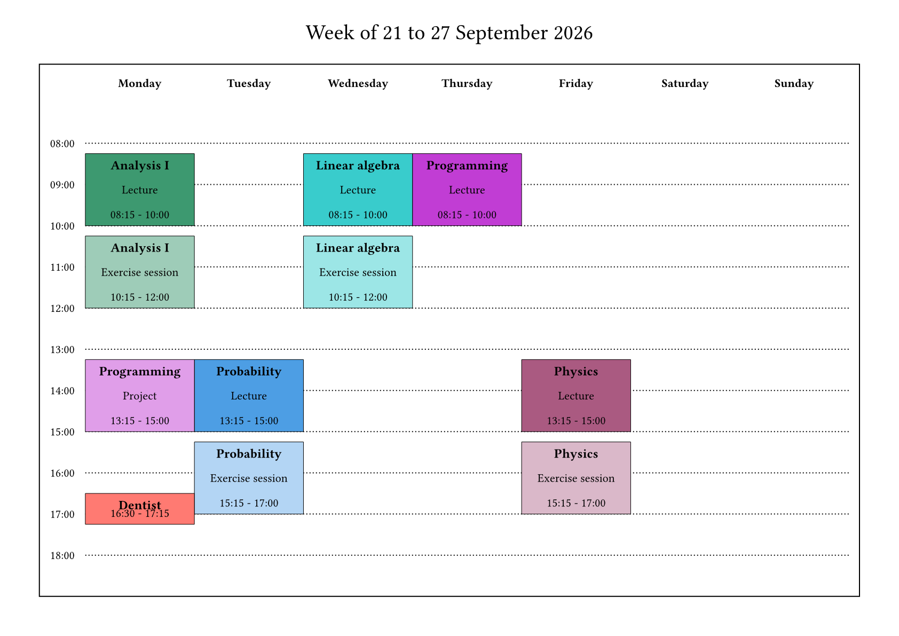
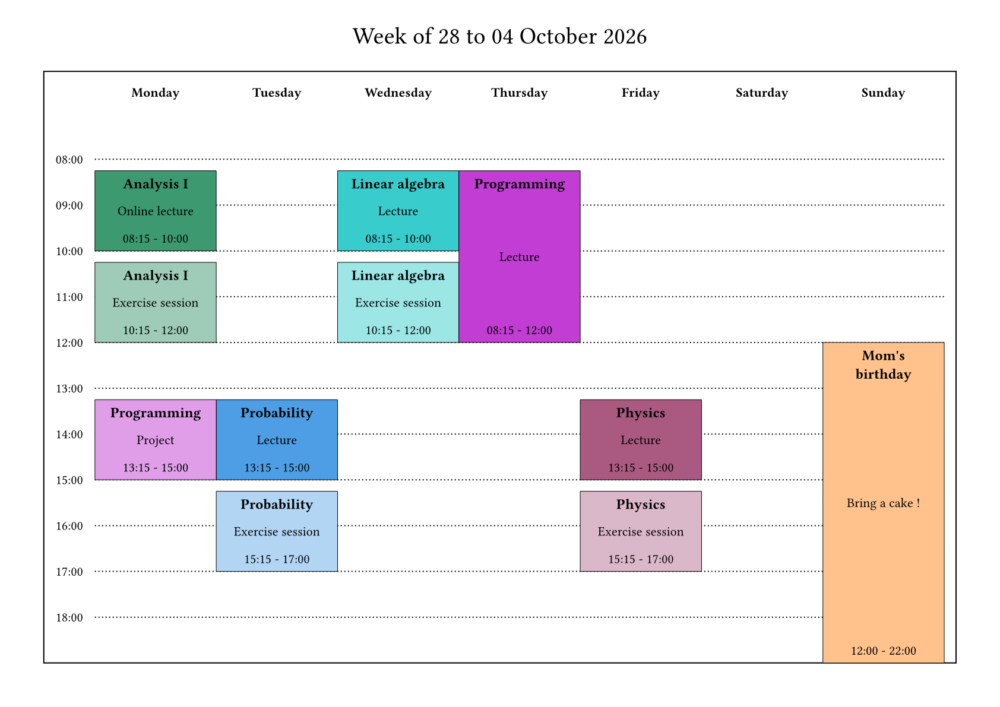
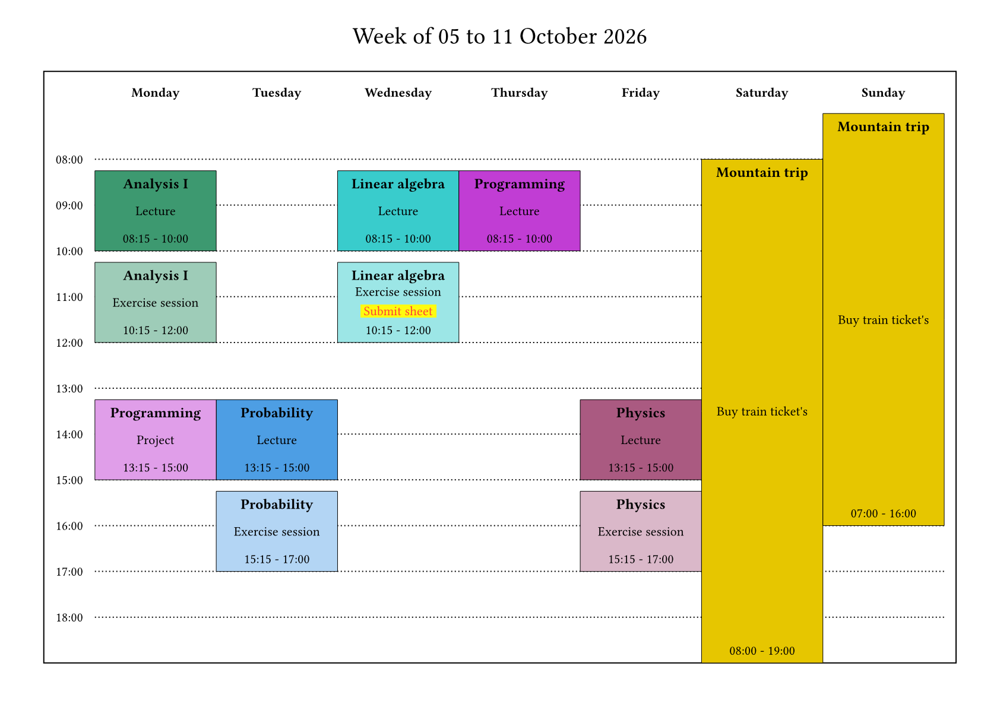

# Weeklendar

_Weeklendar_ (contraction of _week_ and _calendar_) is a Typst package for creating flexible weekly calendars. Its visual design is based on the LaTeX [timetable](https://www.overleaf.com/latex/templates/timetable/npdzfmychtjm) template on Overleaf. It is ideal for people whose weekly timetables vary from week to week. Its main features are
- highly customizable title, time slices, week's days, and events styling
- displaying events on multiple days or weeks
- a compact syntax for periodic events, which can each be singly edited

The [manual](https://github.com/Yesteeer/typst-weeklendar/blob/main/docs/manual.pdf?raw=true) explains how to use these features and contains multiple examples.

## Dependencies

_Weeklendar_ is using [cetz:0.5.2](https://typst.app/universe/package/cetz/).

## Quickstart

Install the package locally (as described on the [Typst Packages](https://github.com/typst/packages)) repository. Then import and use _weeklendar_. 

```typst
#import "@local/weeklendar:0.1.0": weeklendar
```

## Functions

The package comes with a single function `weeklendar()` which generates a weekly calendar.

## Example

Here is an example output, with default styling. More on styling customization can be found in the [manual](https://github.com/Yesteeer/typst-weeklendar/blob/main/docs/manual.pdf?raw=true). Click on the images for the source code.

[](assets/readme-example.typ)
[](assets/readme-example.typ)
[](assets/readme-example.typ)
